---
redirect_from:
  - "/features/abcd-quick-stats"
interact_link: content/features/ABCD_quick_stats.ipynb
kernel_name: ir
has_widgets: false
title: 'Jupyter notebooks'
prev_page:
  url: /features/research.html
  title: 'Markdown files'
next_page:
  url: 
  title: ''
comment: "***PROGRAMMATICALLY GENERATED, DO NOT EDIT. SEE ORIGINAL FILES IN /content***"
---


<div markdown="1" class="cell code_cell">
<div class="input_area" markdown="1">
```R
library(psych)
library(ggplot2)
library(plyr)

```
</div>

</div>


<div markdown="1" class="cell code_cell">
<div class="input_area" markdown="1">
```R
data<-read.table("~/Google Drive//ABCD/tmp//FC.csv", sep=",", header=T)

```
</div>

</div>


<div markdown="1" class="cell code_cell">
<div class="input_area" markdown="1">
```R
summary(data)

```
</div>

<div class="output_wrapper" markdown="1">
<div class="output_subarea" markdown="1">
{:.output_data_text}
```
                subjects   sex               PCS               OVOB   
 sub-NDARINV019DXLU4:  1   F:57   earlypubertal:35   Normalweight:44  
 sub-NDARINV030W95VP:  1   M:63   latepubertal :44   Obese       :41  
 sub-NDARINV08FUB58A:  1          midpubertal  :41   Overweight  :35  
 sub-NDARINV0A4ZDYNL:  1                                              
 sub-NDARINV0FUC15ZB:  1                                              
 sub-NDARINV0L7XB3AW:  1                                              
 (Other)            :114                                              
      mean              SD         
 Min.   :0.1422   Min.   :0.01348  
 1st Qu.:0.4418   1st Qu.:0.05224  
 Median :0.5876   Median :0.08936  
 Mean   :0.7538   Mean   :0.11366  
 3rd Qu.:1.0848   3rd Qu.:0.15291  
 Max.   :1.5713   Max.   :0.41029  
                  NA's   :3        
```

</div>
</div>
</div>


<div markdown="1" class="cell code_cell">
<div class="input_area" markdown="1">
```R
5*3.7

```
</div>

<div class="output_wrapper" markdown="1">
<div class="output_subarea" markdown="1">

<div markdown="0" class="output output_html">
18.5
</div>

</div>
</div>
</div>


<div markdown="1" class="cell code_cell">
<div class="input_area" markdown="1">
```R
describe(data)

```
</div>

<div class="output_wrapper" markdown="1">
<div class="output_subarea" markdown="1">

<div markdown="0" class="output output_html">
<table>
<thead><tr><th></th><th scope=col>vars</th><th scope=col>n</th><th scope=col>mean</th><th scope=col>sd</th><th scope=col>median</th><th scope=col>trimmed</th><th scope=col>mad</th><th scope=col>min</th><th scope=col>max</th><th scope=col>range</th><th scope=col>skew</th><th scope=col>kurtosis</th><th scope=col>se</th></tr></thead>
<tbody>
	<tr><th scope=row>subjects*</th><td>1          </td><td>120        </td><td>60.5000000 </td><td>34.78505426</td><td>60.50000000</td><td>60.5000000 </td><td>44.47800000</td><td>1.00000000 </td><td>120.0000000</td><td>119.0000000</td><td> 0.00000000</td><td>-1.230039  </td><td>3.175426481</td></tr>
	<tr><th scope=row>sex*</th><td>2          </td><td>120        </td><td> 1.5250000 </td><td> 0.50146843</td><td> 2.00000000</td><td> 1.5312500 </td><td> 0.00000000</td><td>1.00000000 </td><td>  2.0000000</td><td>  1.0000000</td><td>-0.09887628</td><td>-2.006739  </td><td>0.045777595</td></tr>
	<tr><th scope=row>PCS*</th><td>3          </td><td>120        </td><td> 2.0500000 </td><td> 0.79758037</td><td> 2.00000000</td><td> 2.0625000 </td><td> 1.48260000</td><td>1.00000000 </td><td>  3.0000000</td><td>  2.0000000</td><td>-0.08820022</td><td>-1.436209  </td><td>0.072808794</td></tr>
	<tr><th scope=row>OVOB*</th><td>4          </td><td>120        </td><td> 1.9250000 </td><td> 0.81129112</td><td> 2.00000000</td><td> 1.9062500 </td><td> 1.48260000</td><td>1.00000000 </td><td>  3.0000000</td><td>  2.0000000</td><td> 0.13536160</td><td>-1.481234  </td><td>0.074060408</td></tr>
	<tr><th scope=row>mean</th><td>5          </td><td>120        </td><td> 0.7538456 </td><td> 0.37553134</td><td> 0.58762983</td><td> 0.7254258 </td><td> 0.32269024</td><td>0.14218636 </td><td>  1.5712619</td><td>  1.4290756</td><td> 0.49974512</td><td>-1.177539  </td><td>0.034281165</td></tr>
	<tr><th scope=row>SD</th><td>6          </td><td>117        </td><td> 0.1136616 </td><td> 0.08364751</td><td> 0.08935992</td><td> 0.1024034 </td><td> 0.06392346</td><td>0.01348003 </td><td>  0.4102934</td><td>  0.3968134</td><td> 1.30226169</td><td> 1.366316  </td><td>0.007733215</td></tr>
</tbody>
</table>

</div>

</div>
</div>
</div>


<div markdown="1" class="cell code_cell">
<div class="input_area" markdown="1">
```R
# Basic box plot
p <- ggplot(data, aes(x=PCS, y=mean)) +  
  geom_boxplot(outlier.colour="red", outlier.shape=8,
                outlier.size=4)
p

```
</div>

<div class="output_wrapper" markdown="1">
<div class="output_subarea" markdown="1">

{:.output_png}


</div>
</div>
</div>


<div markdown="1" class="cell code_cell">
<div class="input_area" markdown="1">
```R
model1<-lm(mean~PCS, data=data)
summary(model1)

```
</div>

<div class="output_wrapper" markdown="1">
<div class="output_subarea" markdown="1">
{:.output_data_text}
```

Call:
lm(formula = mean ~ PCS, data = data)

Residuals:
    Min      1Q  Median      3Q     Max 
-0.6213 -0.3141 -0.1699  0.3272  0.8077 

Coefficients:
                Estimate Std. Error t value Pr(>|t|)    
(Intercept)     0.745543   0.064004  11.648   <2e-16 ***
PCSlatepubertal 0.005878   0.085762   0.069    0.945    
PCSmidpubertal  0.017991   0.087141   0.206    0.837    
---
Signif. codes:  0 ‘***’ 0.001 ‘**’ 0.01 ‘*’ 0.05 ‘.’ 0.1 ‘ ’ 1

Residual standard error: 0.3787 on 117 degrees of freedom
Multiple R-squared:  0.0003885,	Adjusted R-squared:  -0.0167 
F-statistic: 0.02274 on 2 and 117 DF,  p-value: 0.9775

```

</div>
</div>
</div>


<div markdown="1" class="cell code_cell">
<div class="input_area" markdown="1">
```R
plot(model1)

```
</div>

<div class="output_wrapper" markdown="1">
<div class="output_subarea" markdown="1">

{:.output_png}
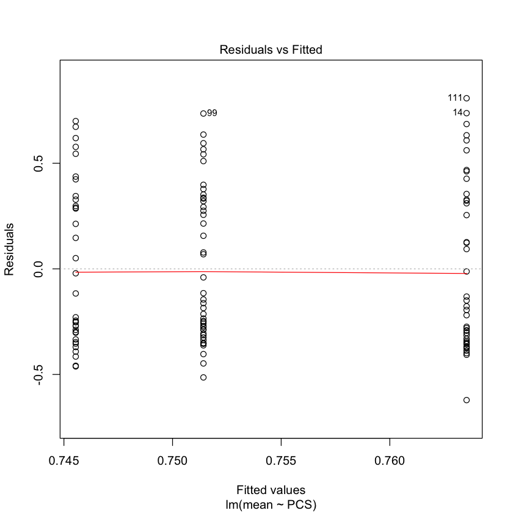

</div>
</div>
<div class="output_wrapper" markdown="1">
<div class="output_subarea" markdown="1">

{:.output_png}


</div>
</div>
<div class="output_wrapper" markdown="1">
<div class="output_subarea" markdown="1">

{:.output_png}


</div>
</div>
<div class="output_wrapper" markdown="1">
<div class="output_subarea" markdown="1">

{:.output_png}


</div>
</div>
</div>


<div markdown="1" class="cell code_cell">
<div class="input_area" markdown="1">
```R
q <- ggplot(data, aes(x=PCS, y=SD)) +  
  geom_boxplot(outlier.colour="red", outlier.shape=8,
                outlier.size=4)
q

```
</div>

<div class="output_wrapper" markdown="1">
<div class="output_subarea" markdown="1">

{:.output_png}
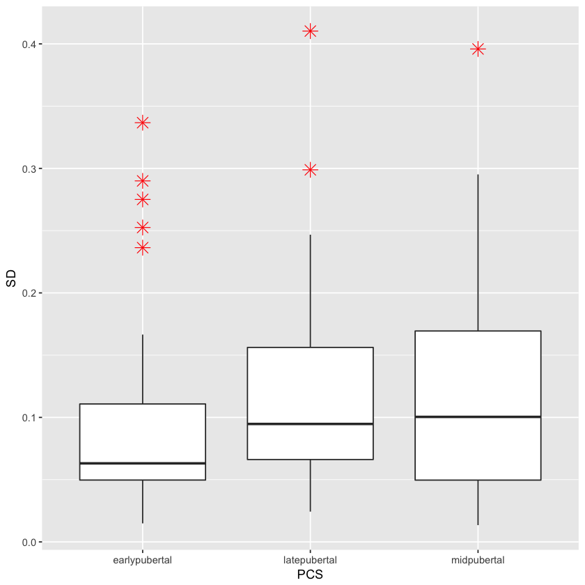

</div>
</div>
</div>


<div markdown="1" class="cell code_cell">
<div class="input_area" markdown="1">
```R
model1<-lm(mean~PCS, data=data)
summary(model1)

```
</div>

<div class="output_wrapper" markdown="1">
<div class="output_subarea" markdown="1">
{:.output_data_text}
```

Call:
lm(formula = mean ~ PCS, data = data)

Residuals:
    Min      1Q  Median      3Q     Max 
-0.6213 -0.3141 -0.1699  0.3272  0.8077 

Coefficients:
                Estimate Std. Error t value Pr(>|t|)    
(Intercept)     0.745543   0.064004  11.648   <2e-16 ***
PCSlatepubertal 0.005878   0.085762   0.069    0.945    
PCSmidpubertal  0.017991   0.087141   0.206    0.837    
---
Signif. codes:  0 ‘***’ 0.001 ‘**’ 0.01 ‘*’ 0.05 ‘.’ 0.1 ‘ ’ 1

Residual standard error: 0.3787 on 117 degrees of freedom
Multiple R-squared:  0.0003885,	Adjusted R-squared:  -0.0167 
F-statistic: 0.02274 on 2 and 117 DF,  p-value: 0.9775

```

</div>
</div>
</div>


<div markdown="1" class="cell code_cell">
<div class="input_area" markdown="1">
```R
plot(model1)

```
</div>

<div class="output_wrapper" markdown="1">
<div class="output_subarea" markdown="1">

{:.output_png}


</div>
</div>
<div class="output_wrapper" markdown="1">
<div class="output_subarea" markdown="1">

{:.output_png}


</div>
</div>
<div class="output_wrapper" markdown="1">
<div class="output_subarea" markdown="1">

{:.output_png}
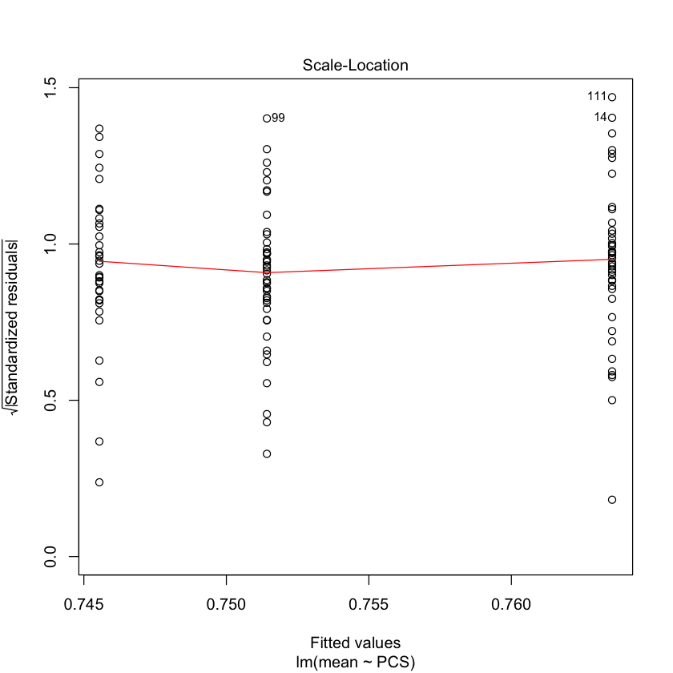

</div>
</div>
<div class="output_wrapper" markdown="1">
<div class="output_subarea" markdown="1">

{:.output_png}
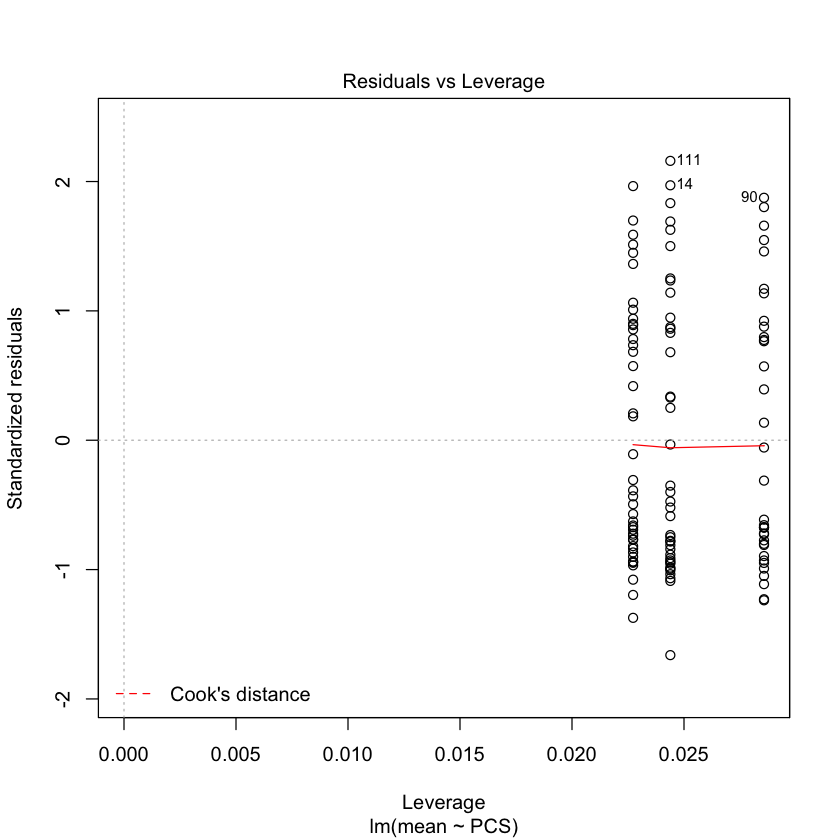

</div>
</div>
</div>


<div markdown="1" class="cell code_cell">
<div class="input_area" markdown="1">
```R
qplot(data$mean, geom="histogram") 

```
</div>

<div class="output_wrapper" markdown="1">
<div class="output_subarea" markdown="1">

{:.output_png}


</div>
</div>
</div>


<div markdown="1" class="cell code_cell">
<div class="input_area" markdown="1">
```R
qplot(sqrt(data$mean), geom="histogram") 

```
</div>

<div class="output_wrapper" markdown="1">
<div class="output_subarea" markdown="1">

{:.output_png}
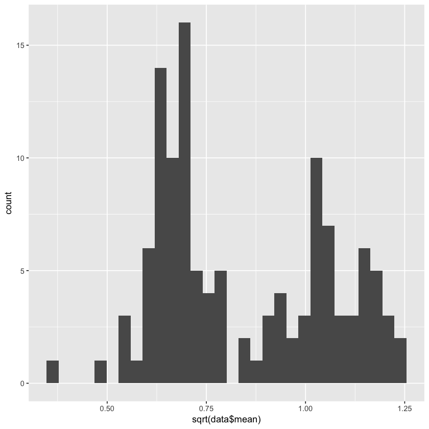

</div>
</div>
</div>


<div markdown="1" class="cell code_cell">
<div class="input_area" markdown="1">
```R
model2<-lm(sqrt(mean)~as.factor(PCS), data=data)
summary(model2)

```
</div>

<div class="output_wrapper" markdown="1">
<div class="output_subarea" markdown="1">
{:.output_data_text}
```

Call:
lm(formula = sqrt(mean) ~ as.factor(PCS), data = data)

Residuals:
    Min      1Q  Median      3Q     Max 
-0.4671 -0.1773 -0.0770  0.1986  0.4093 

Coefficients:
                           Estimate Std. Error t value Pr(>|t|)    
(Intercept)                0.836657   0.036574  22.876   <2e-16 ***
as.factor(PCS)latepubertal 0.006271   0.049007   0.128    0.898    
as.factor(PCS)midpubertal  0.007558   0.049795   0.152    0.880    
---
Signif. codes:  0 ‘***’ 0.001 ‘**’ 0.01 ‘*’ 0.05 ‘.’ 0.1 ‘ ’ 1

Residual standard error: 0.2164 on 117 degrees of freedom
Multiple R-squared:  0.0002213,	Adjusted R-squared:  -0.01687 
F-statistic: 0.01295 on 2 and 117 DF,  p-value: 0.9871

```

</div>
</div>
</div>


<div markdown="1" class="cell code_cell">
<div class="input_area" markdown="1">
```R
plot(model2)

```
</div>

<div class="output_wrapper" markdown="1">
<div class="output_subarea" markdown="1">

{:.output_png}


</div>
</div>
<div class="output_wrapper" markdown="1">
<div class="output_subarea" markdown="1">

{:.output_png}


</div>
</div>
<div class="output_wrapper" markdown="1">
<div class="output_subarea" markdown="1">

{:.output_png}
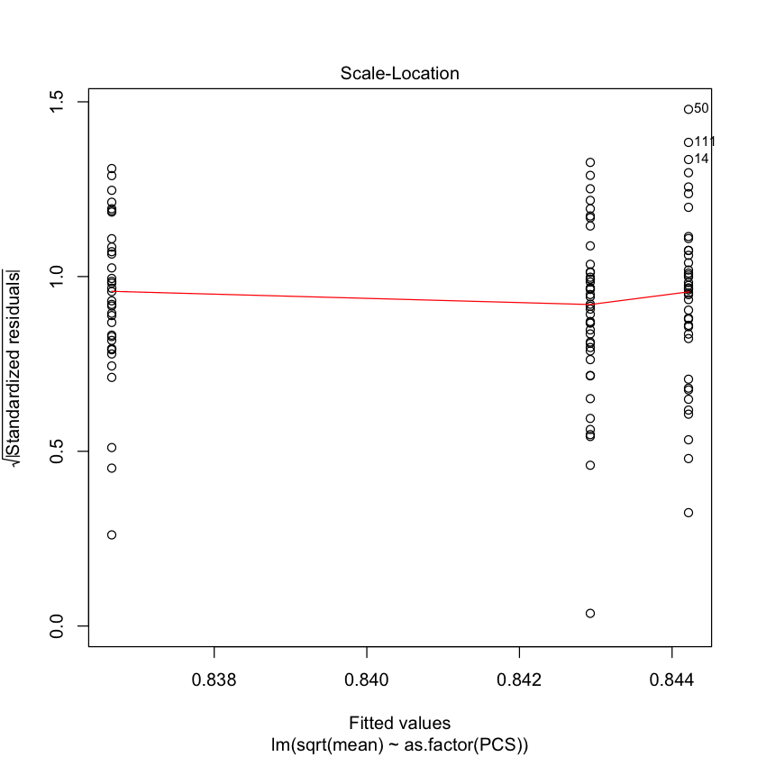

</div>
</div>
<div class="output_wrapper" markdown="1">
<div class="output_subarea" markdown="1">

{:.output_png}
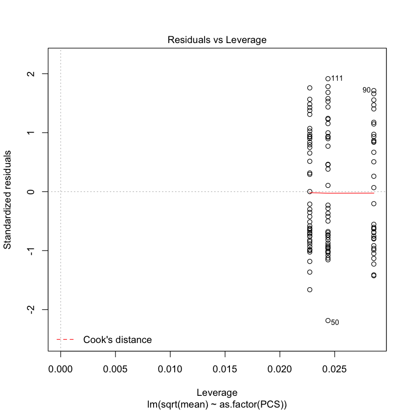

</div>
</div>
</div>


### No difference in FC between pubertal groups


<div markdown="1" class="cell code_cell">
<div class="input_area" markdown="1">
```R
# Basic box plot
p <- ggplot(data, aes(x=OVOB, y=mean)) +  
  geom_boxplot(outlier.colour="red", outlier.shape=8,
                outlier.size=4)
p

```
</div>

<div class="output_wrapper" markdown="1">
<div class="output_subarea" markdown="1">

{:.output_png}
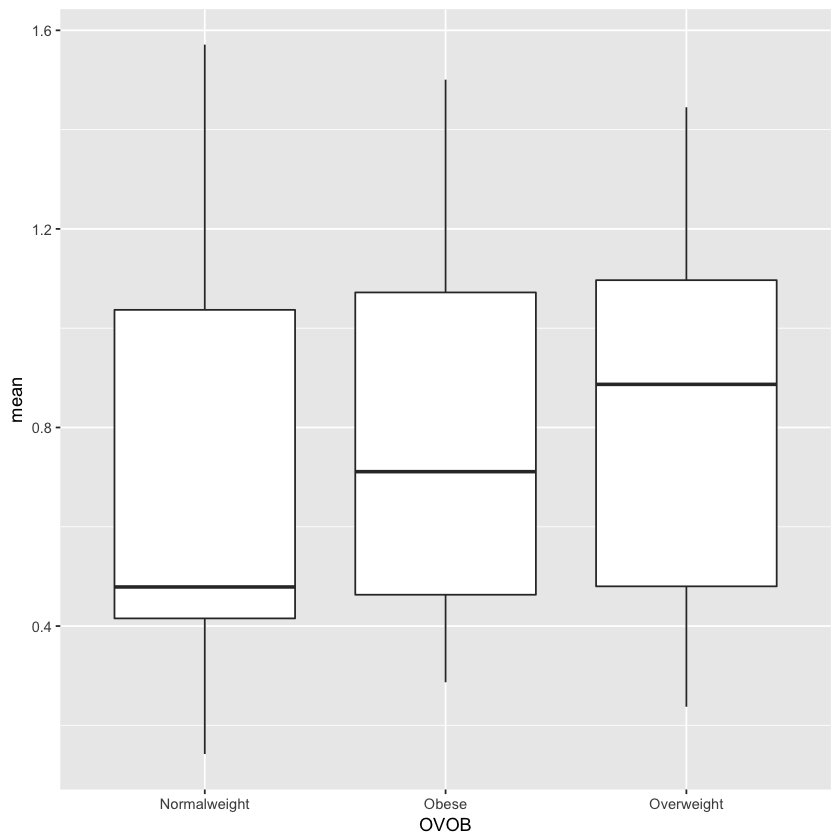

</div>
</div>
</div>


<div markdown="1" class="cell code_cell">
<div class="input_area" markdown="1">
```R
# Basic box plot
p <- ggplot(data, aes(x=OVOB, y=SD)) +  
  geom_boxplot(outlier.colour="red", outlier.shape=8,
                outlier.size=4)
p

```
</div>

<div class="output_wrapper" markdown="1">
<div class="output_subarea" markdown="1">

{:.output_png}


</div>
</div>
</div>


<div markdown="1" class="cell code_cell">
<div class="input_area" markdown="1">
```R
model3<-lm(mean~OVOB, data=data)
summary(model3)

```
</div>

<div class="output_wrapper" markdown="1">
<div class="output_subarea" markdown="1">
{:.output_data_text}
```

Call:
lm(formula = mean ~ OVOB, data = data)

Residuals:
    Min      1Q  Median      3Q     Max 
-0.5958 -0.2962 -0.1610  0.3136  0.8856 

Coefficients:
               Estimate Std. Error t value Pr(>|t|)    
(Intercept)     0.68566    0.05636  12.165   <2e-16 ***
OVOBObese       0.07354    0.08116   0.906   0.3667    
OVOBOverweight  0.14762    0.08468   1.743   0.0839 .  
---
Signif. codes:  0 ‘***’ 0.001 ‘**’ 0.01 ‘*’ 0.05 ‘.’ 0.1 ‘ ’ 1

Residual standard error: 0.3739 on 117 degrees of freedom
Multiple R-squared:  0.02542,	Adjusted R-squared:  0.008759 
F-statistic: 1.526 on 2 and 117 DF,  p-value: 0.2217

```

</div>
</div>
</div>


<div markdown="1" class="cell code_cell">
<div class="input_area" markdown="1">
```R
plot(model3)

```
</div>

<div class="output_wrapper" markdown="1">
<div class="output_subarea" markdown="1">

{:.output_png}
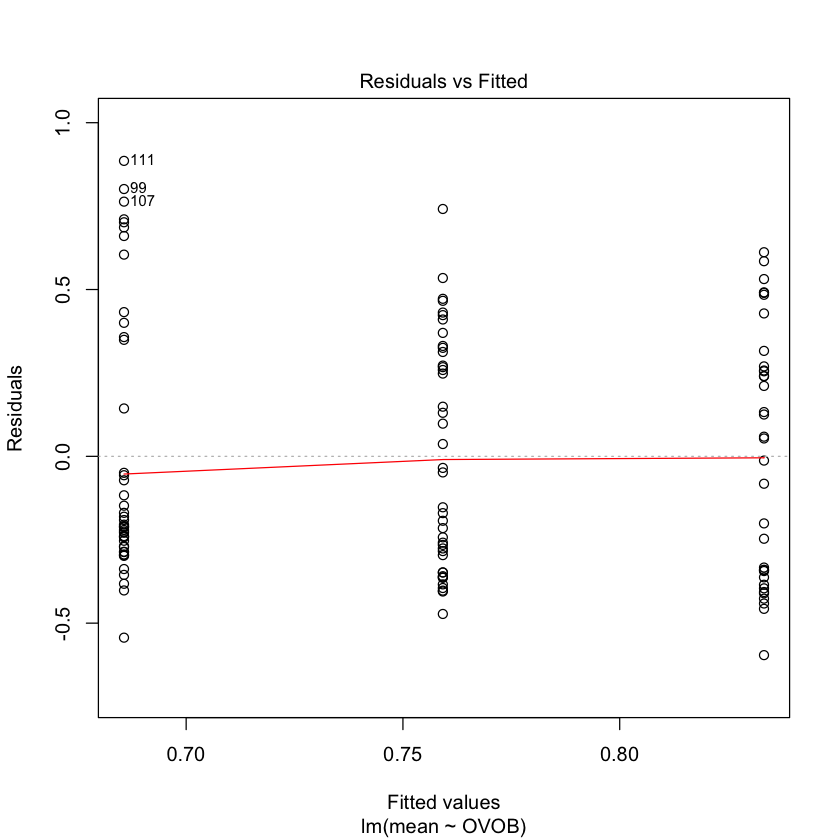

</div>
</div>
<div class="output_wrapper" markdown="1">
<div class="output_subarea" markdown="1">

{:.output_png}


</div>
</div>
<div class="output_wrapper" markdown="1">
<div class="output_subarea" markdown="1">

{:.output_png}


</div>
</div>
<div class="output_wrapper" markdown="1">
<div class="output_subarea" markdown="1">

{:.output_png}
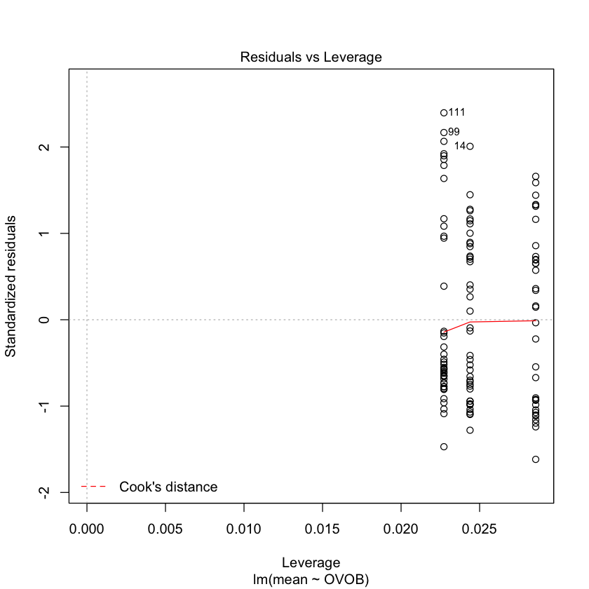

</div>
</div>
</div>


<div markdown="1" class="cell code_cell">
<div class="input_area" markdown="1">
```R
model4<-lm(log(mean)~OVOB, data=data)
summary(model4)

```
</div>

<div class="output_wrapper" markdown="1">
<div class="output_subarea" markdown="1">
{:.output_data_text}
```

Call:
lm(formula = log(mean) ~ OVOB, data = data)

Residuals:
    Min      1Q  Median      3Q     Max 
-1.4198 -0.4017 -0.1248  0.4369  0.9827 

Coefficients:
               Estimate Std. Error t value Pr(>|t|)    
(Intercept)    -0.53085    0.07692  -6.901 2.82e-10 ***
OVOBObese       0.15019    0.11075   1.356    0.178    
OVOBOverweight  0.23757    0.11556   2.056    0.042 *  
---
Signif. codes:  0 ‘***’ 0.001 ‘**’ 0.01 ‘*’ 0.05 ‘.’ 0.1 ‘ ’ 1

Residual standard error: 0.5102 on 117 degrees of freedom
Multiple R-squared:  0.03652,	Adjusted R-squared:  0.02005 
F-statistic: 2.218 on 2 and 117 DF,  p-value: 0.1134

```

</div>
</div>
</div>


<div markdown="1" class="cell code_cell">
<div class="input_area" markdown="1">
```R
plot(model4)

```
</div>

<div class="output_wrapper" markdown="1">
<div class="output_subarea" markdown="1">

{:.output_png}
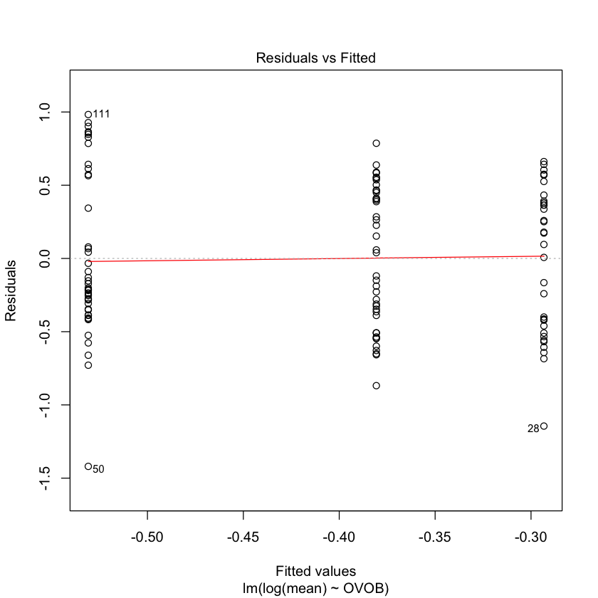

</div>
</div>
<div class="output_wrapper" markdown="1">
<div class="output_subarea" markdown="1">

{:.output_png}


</div>
</div>
<div class="output_wrapper" markdown="1">
<div class="output_subarea" markdown="1">

{:.output_png}


</div>
</div>
<div class="output_wrapper" markdown="1">
<div class="output_subarea" markdown="1">

{:.output_png}
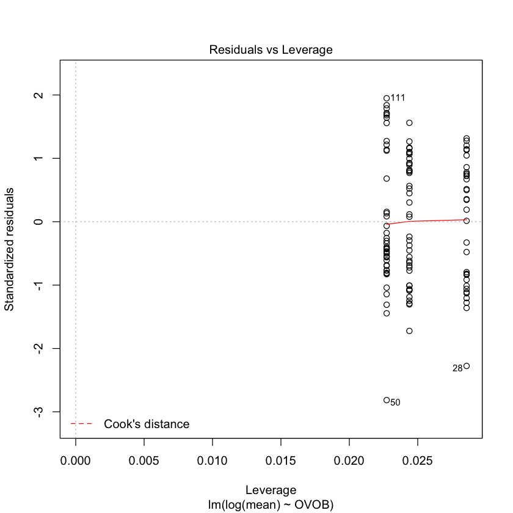

</div>
</div>
</div>


### Trending difference with ov compared to normal weight
May want to control models for FC


## Looking at modules


<div markdown="1" class="cell code_cell">
<div class="input_area" markdown="1">
```R
data<-read.table("~/Google Drive/ABCD/tmp/total_ovob.csv", header=T, sep=",")

```
</div>

</div>


<div markdown="1" class="cell code_cell">
<div class="input_area" markdown="1">
```R
describeBy(data$PC, data$OVOB)

```
</div>

<div class="output_wrapper" markdown="1">
<div class="output_subarea" markdown="1">
{:.output_data_text}
```

 Descriptive statistics by group 
group: normal
   vars   n mean   sd median trimmed  mad  min max range  skew kurtosis se
X1    1 264 0.79 0.01   0.79    0.79 0.01 0.77 0.8  0.04 -0.13    -0.96  0
------------------------------------------------------------ 
group: obese
   vars   n mean   sd median trimmed  mad  min  max range  skew kurtosis se
X1    1 264 0.74 0.01   0.74    0.74 0.01 0.71 0.76  0.05 -0.63    -0.79  0
------------------------------------------------------------ 
group: overweight
   vars   n mean   sd median trimmed  mad min  max range skew kurtosis se
X1    1 264 0.73 0.01   0.73    0.73 0.01 0.7 0.75  0.04 -0.6    -0.51  0
```

</div>
</div>
</div>


<div markdown="1" class="cell code_cell">
<div class="input_area" markdown="1">
```R
p <- ggplot(data, aes(x=OVOB, y=PC)) +  
  geom_boxplot(outlier.colour="red", outlier.shape=8,
                outlier.size=4)+facet_grid(.~color)
p

```
</div>

<div class="output_wrapper" markdown="1">
<div class="output_subarea" markdown="1">

{:.output_png}
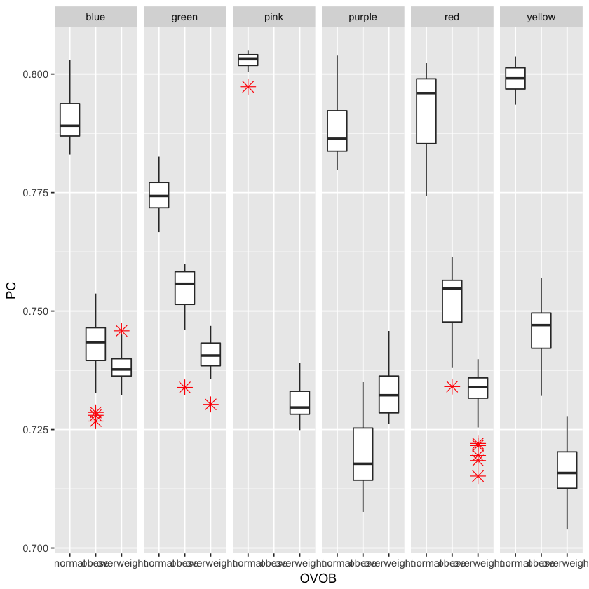

</div>
</div>
</div>


<div markdown="1" class="cell code_cell">
<div class="input_area" markdown="1">
```R
model1<-lm(PC~OVOB, data=data)
summary(model1)

```
</div>

<div class="output_wrapper" markdown="1">
<div class="output_subarea" markdown="1">
{:.output_data_text}
```

Call:
lm(formula = PC ~ OVOB, data = data)

Residuals:
      Min        1Q    Median        3Q       Max 
-0.030725 -0.007761  0.002208  0.008649  0.023076 

Coefficients:
                 Estimate Std. Error t value Pr(>|t|)    
(Intercept)     0.7876380  0.0007091 1110.77   <2e-16 ***
OVOBobese      -0.0492821  0.0010028  -49.14   <2e-16 ***
OVOBoverweight -0.0581736  0.0010028  -58.01   <2e-16 ***
---
Signif. codes:  0 ‘***’ 0.001 ‘**’ 0.01 ‘*’ 0.05 ‘.’ 0.1 ‘ ’ 1

Residual standard error: 0.01152 on 789 degrees of freedom
Multiple R-squared:  0.8319,	Adjusted R-squared:  0.8315 
F-statistic:  1953 on 2 and 789 DF,  p-value: < 2.2e-16

```

</div>
</div>
</div>


<div markdown="1" class="cell code_cell">
<div class="input_area" markdown="1">
```R
model1<-lm(PC~OVOB:color, data=data)
summary(model1)

```
</div>

<div class="output_wrapper" markdown="1">
<div class="output_subarea" markdown="1">
{:.output_data_text}
```

Call:
lm(formula = PC ~ OVOB:color, data = data)

Residuals:
       Min         1Q     Median         3Q        Max 
-0.0200395 -0.0035147  0.0000738  0.0037379  0.0156417 

Coefficients: (2 not defined because of singularities)
                            Estimate Std. Error  t value Pr(>|t|)    
(Intercept)                0.7160135  0.0006502 1101.211  < 2e-16 ***
OVOBnormal:colorblue       0.0747392  0.0009762   76.559  < 2e-16 ***
OVOBobese:colorblue        0.0267030  0.0010011   26.675  < 2e-16 ***
OVOBoverweight:colorblue   0.0222834  0.0011163   19.962  < 2e-16 ***
OVOBnormal:colorgreen      0.0584736  0.0009588   60.984  < 2e-16 ***
OVOBobese:colorgreen       0.0379104  0.0014096   26.894  < 2e-16 ***
OVOBoverweight:colorgreen  0.0248423  0.0011966   20.760  < 2e-16 ***
OVOBnormal:colorpink       0.0865644  0.0018074   47.893  < 2e-16 ***
OVOBobese:colorpink               NA         NA       NA       NA    
OVOBoverweight:colorpink   0.0146698  0.0010179   14.411  < 2e-16 ***
OVOBnormal:colorpurple     0.0722537  0.0009470   76.299  < 2e-16 ***
OVOBobese:colorpurple      0.0038009  0.0009021    4.213 2.81e-05 ***
OVOBoverweight:colorpurple 0.0178013  0.0015421   11.544  < 2e-16 ***
OVOBnormal:colorred        0.0769292  0.0010239   75.130  < 2e-16 ***
OVOBobese:colorred         0.0350257  0.0013829   25.327  < 2e-16 ***
OVOBoverweight:colorred    0.0166882  0.0010011   16.671  < 2e-16 ***
OVOBnormal:coloryellow     0.0832000  0.0015838   52.532  < 2e-16 ***
OVOBobese:coloryellow      0.0298719  0.0008799   33.948  < 2e-16 ***
OVOBoverweight:coloryellow        NA         NA       NA       NA    
---
Signif. codes:  0 ‘***’ 0.001 ‘**’ 0.01 ‘*’ 0.05 ‘.’ 0.1 ‘ ’ 1

Residual standard error: 0.005593 on 775 degrees of freedom
Multiple R-squared:  0.9611,	Adjusted R-squared:  0.9603 
F-statistic:  1197 on 16 and 775 DF,  p-value: < 2.2e-16

```

</div>
</div>
</div>


<div markdown="1" class="cell code_cell">
<div class="input_area" markdown="1">
```R
data<-read.table("~/Google Drive/ABCD/tmp/total_PCS.csv", header=T, sep=",")

```
</div>

</div>


<div markdown="1" class="cell code_cell">
<div class="input_area" markdown="1">
```R
head(data)

```
</div>

<div class="output_wrapper" markdown="1">
<div class="output_subarea" markdown="1">

<div markdown="0" class="output output_html">
<table>
<thead><tr><th scope=col>ROI</th><th scope=col>labels</th><th scope=col>PC</th><th scope=col>PCS</th><th scope=col>color</th></tr></thead>
<tbody>
	<tr><td>0                   </td><td>Precuneus           </td><td>0.7627043           </td><td>early               </td><td>blue                </td></tr>
	<tr><td>1                   </td><td>Cingulate Gyrus     </td><td>0.7673773           </td><td>early               </td><td>blue                </td></tr>
	<tr><td>2                   </td><td>Paracentral Lobule  </td><td>0.7672354           </td><td>early               </td><td>blue                </td></tr>
	<tr><td>3                   </td><td>Cingulate Gyrus     </td><td>0.7652419           </td><td>early               </td><td>blue                </td></tr>
	<tr><td>4                   </td><td>Medial Frontal Gyrus</td><td>0.7619666           </td><td>early               </td><td>blue                </td></tr>
	<tr><td>5                   </td><td>Postcentral Gyrus   </td><td>0.7631456           </td><td>early               </td><td>blue                </td></tr>
</tbody>
</table>

</div>

</div>
</div>
</div>


<div markdown="1" class="cell code_cell">
<div class="input_area" markdown="1">
```R
p <- ggplot(data, aes(x=PCS, y=PC)) +  
  geom_boxplot(outlier.colour="red", outlier.shape=8,
                outlier.size=4)
p

```
</div>

<div class="output_wrapper" markdown="1">
<div class="output_subarea" markdown="1">

{:.output_png}


</div>
</div>
</div>


<div markdown="1" class="cell code_cell">
<div class="input_area" markdown="1">
```R
model1<-lm(PC~PCS:color, data=data)
summary(model1)

```
</div>

<div class="output_wrapper" markdown="1">
<div class="output_subarea" markdown="1">
{:.output_data_text}
```

Call:
lm(formula = PC ~ PCS:color, data = data)

Residuals:
      Min        1Q    Median        3Q       Max 
-0.016243 -0.004055 -0.000719  0.004318  0.014339 

Coefficients: (2 not defined because of singularities)
                       Estimate Std. Error  t value Pr(>|t|)    
(Intercept)           0.8171985  0.0007091 1152.478  < 2e-16 ***
PCSearly:colorblue   -0.0530573  0.0010561  -50.240  < 2e-16 ***
PCSlate:colorblue    -0.0481072  0.0009920  -48.496  < 2e-16 ***
PCSmid:colorblue     -0.0108838  0.0010186  -10.685  < 2e-16 ***
PCSearly:colorgreen  -0.0459197  0.0011994  -38.286  < 2e-16 ***
PCSlate:colorgreen   -0.0443645  0.0015409  -28.792  < 2e-16 ***
PCSmid:colorgreen     0.0039122  0.0012901    3.032  0.00251 ** 
PCSearly:colorpink   -0.0622088  0.0009820  -63.351  < 2e-16 ***
PCSlate:colorpink    -0.0457284  0.0009991  -45.770  < 2e-16 ***
PCSmid:colorpink     -0.0127256  0.0010186  -12.493  < 2e-16 ***
PCSearly:colorpurple -0.0424557  0.0041649  -10.194  < 2e-16 ***
PCSlate:colorpurple          NA         NA       NA       NA    
PCSmid:colorpurple    0.0047213  0.0017590    2.684  0.00743 ** 
PCSearly:colorred    -0.0456380  0.0015086  -30.252  < 2e-16 ***
PCSlate:colorred     -0.0458348  0.0014027  -32.677  < 2e-16 ***
PCSmid:colorred      -0.0008609  0.0012901   -0.667  0.50479    
PCSearly:coloryellow -0.0687872  0.0009640  -71.359  < 2e-16 ***
PCSlate:coloryellow  -0.0733486  0.0009482  -77.354  < 2e-16 ***
PCSmid:coloryellow           NA         NA       NA       NA    
---
Signif. codes:  0 ‘***’ 0.001 ‘**’ 0.01 ‘*’ 0.05 ‘.’ 0.1 ‘ ’ 1

Residual standard error: 0.005804 on 775 degrees of freedom
Multiple R-squared:  0.9546,	Adjusted R-squared:  0.9537 
F-statistic:  1018 on 16 and 775 DF,  p-value: < 2.2e-16

```

</div>
</div>
</div>


<div markdown="1" class="cell code_cell">
<div class="input_area" markdown="1">
```R
p <- ggplot(data, aes(x=PCS, y=PC)) +  
  geom_boxplot(outlier.colour="red", outlier.shape=8,
                outlier.size=4)+facet_grid(.~color)
p

```
</div>

<div class="output_wrapper" markdown="1">
<div class="output_subarea" markdown="1">

{:.output_png}
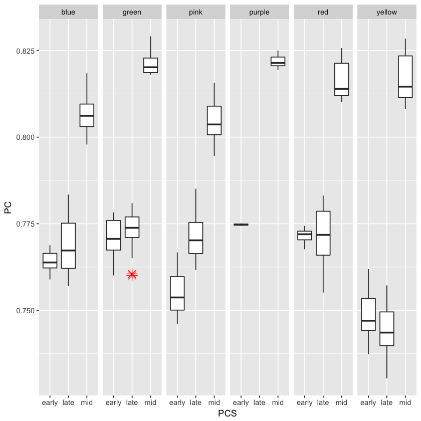

</div>
</div>
</div>

